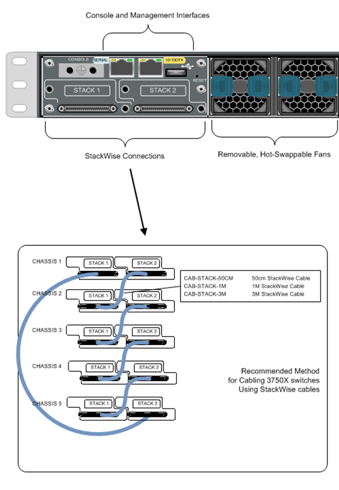
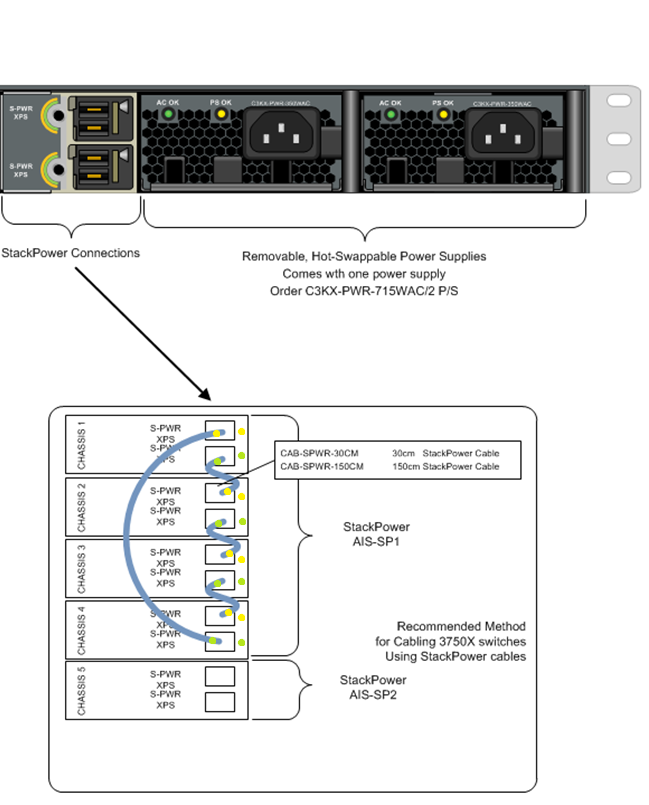
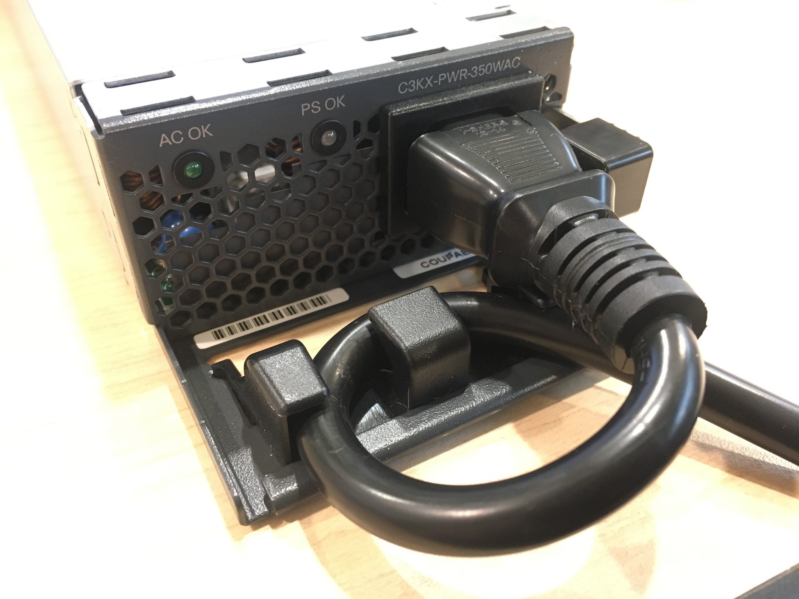

Cisco Switch 設定指南
------------------------------
v20211026 (Sensitive information has been modified or deleted.)
  
### 快速導覽  

##### 如果是要設定一台全新的 `L2 Switch`，請照著下列所列出的章節做：
* Office
    1. [重置 Switch](#-%E9%87%8D%E7%BD%AE-switch)
    2. [基礎設定](#-%E5%9F%BA%E7%A4%8E%E8%A8%AD%E5%AE%9A)
    3. 設定 LACP (可上架前做也可以先做好)
        * [Port-channel command](#port-channel-command) => Link Aggregation Control Protocol (LACP)
* IDC
    1. [重置 Switch](#-%E9%87%8D%E7%BD%AE-switch)
    2. [基礎設定](#-%E5%9F%BA%E7%A4%8E%E8%A8%AD%E5%AE%9A)
    3. 設定 LACP (可上架前做也可以先做好)   
        * [Port-channel command](#port-channel-command) => Link Aggregation Control Protocol (LACP) 
    4. [加入路由表](#%E6%89%8B%E5%8B%95%E5%8A%A0%E5%85%A5-route-table%E6%B7%A1%E6%B0%B4-cisco-%E9%81%A9%E7%94%A8) => Only L2 Switch in IDC with open ip routing

##### 如果是要設定一台全新的 `L3 Switch`，請照著下列所列出的章節做：
* Office
    1. [重置 Switch](#-%E9%87%8D%E7%BD%AE-switch)
    2. [基礎設定](#-%E5%9F%BA%E7%A4%8E%E8%A8%AD%E5%AE%9A)
    3. 設定 LACP (可上架前做也可以先做好)
        * [Port-channel command](#port-channel-command) => Link Aggregation Control Protocol (LACP)
    4. [Spanning Tree command](#spanning-tree-command) => 設定 Port Cost (設定在 uplink port )
    5. [Spanning Tree command](#spanning-tree-command) => 設定 root switch (在現有環境`沒有` root switch 的情況下才需要做)

* IDC
    1. [重置 Switch](#-%E9%87%8D%E7%BD%AE-switch)
    2. [基礎設定](#-%E5%9F%BA%E7%A4%8E%E8%A8%AD%E5%AE%9A)
    3. [C3750X 設定](#-c3750x-%E8%A8%AD%E5%AE%9A)
        1. 設定前作業
        2. 指定 Master (依照 Siwtch 順序排列)
    4. 設定 LACP (可上架前做也可以先做好)   
        * [Port-channel command](#port-channel-command) => Link Aggregation Control Protocol (LACP) 
    5. [加入路由表](#%E6%89%8B%E5%8B%95%E5%8A%A0%E5%85%A5-route-table%E6%B7%A1%E6%B0%B4-cisco-%E9%81%A9%E7%94%A8) => Only C3750X in IDC with open ip routing

* IDC => 如果是要把一台全新的 `L3 Switch`，`加入現有的 Stack`。
    1. 參考 [C3750X 障礙更換](#-c3750x-%E9%9A%9C%E7%A4%99%E6%9B%B4%E6%8F%9B) 章節，並依現場情況做處理。


  
### ※ 重置 Switch


- 在開機前，將 Console 線接上，然後按著前面板的 Mode 鍵，開機。


- 開機後持續按著 Mode 鍵不放，這時前面板的 SYST 燈會一直閃爍。


- 直到燈號閃爍停止，這時放開 Mode 鍵，畫面會出現 switch: 的可輸入畫面。


- 此時在 switch: 後面依序輸入以下指令：（每輸入一行就要 Enter 一次。）

    ```go
        : flash_init               //初始化系統韌體。
        : del flash:config.text    //刪掉設定檔。
        : del flash:vlan.dat       //刪掉 vlan 設定。
        : boot                     //重開。
    ```
  
- 重開後會出現 `Would you like to enter the initial configuration dialog? [yes/no]:`


- 承上，輸入 NO，然後按 Enter。


- 接著照以下輸入：

    ```go
        > enable         //進入特權模式
        # write erase    //清空所有內容並恢復原廠預設值
          Erasing the nvram filesystem will remove all configuration files! Continue? [confirm]    //按 Enter 執行。
        # reload         //重啟 Switch
          System configuration has been modified. Save? [yes/no]:    //如果有出現就輸入 NO
          Proceed with reload? [confirm]    //按 Enter，確定將 Switch 重啟。
    ```


- 重開後會出現 `Would you like to enter the initial configuration dialog? [yes/no]:`


- 承上，輸入 NO，然後按 Enter，完成。
  
  
  
### ※ 基礎設定
  
  
* 接上電源，開機完成後接上 Console 線，並連線至 Switch 輸入以下設定。
    * `#` 和 `>` 代表的是 Cisco IOS 系統底下的 Prompt 符號：
        * `>` 代表處於使用者模式（User Mode）。
        * `#` 代表處於特權模式（Privileged Mode）。

**設定機器名稱**

```go
    > enable                //進入特權模式。
    # configure terminal    //進入全域設定模式。
    # hostname [主機名稱]   //e.g. hostname switch001
```

**設定 Rapid Spanning Tree Protocol（RSTP）**

```go
    # configure terminal
    # spanning-tree mode rapid-pvst
    # spanning-tree logging           //開啟 Log 紀錄。
```

**設定 Console 密碼**

```go
    # configure terminal
    # line console 0
    # password [密碼]      //e.g. password 1234
    # login
    # exec-timeout 10      //e.g. 閒置多久登出，設 0 為永不登出（取消 timeout）；（預設為 10；單位：分）
    # logging synchronous  //指令輸入時被打斷會重新補上輸入一半的指令。
    # exit                 //退出 line 設定模式。
```

**設定 enable 密碼**

```go
    # configure terminal
    # enable secret [密碼]    //設定密碼並用 MD5 加密。
```

**加密所有明文密碼（輕量加密方式）**

```go
    # configure terminal
    # service password-encryption
```

**設定 Switch IP**

- **一般情況** 

    ```go
        # configure terminal  
        # interface vlan [vlan編號]     //e.g. interface vlan 1  
        # ip address [A.B.C.D] [mask]   //e.g. ip address 192.168.0.0 255.255.255.0  
        # no shutdown     //啟用 Device。  
        # exit            //退出 interface 設定模式。  
    ```
  
- **使用機器後方的 10/100TX console port //通常 L3 才有。**  

    ```go
        # interface FastEthernet[號碼]   //e.g. interface FastEthernet0  
        # ip address [A.B.C.D] [mask]    //e.g. ip address 192.168.0.1 255.255.255.0  
        # no shutdown  
        # exit          //退出 interface 設定模式。  
    ```
  
**設定 Gateway**

```go
    # configure terminal
    # ip default-gateway [A.B.C.D]
```

**設定 Web console**

```go
    # configure terminal
    # no ip http server                //把 80 port 關掉。
    # ip http authentication local     //使用本地驗證資料庫。
```

**設定 DNS**

```go
    # configure terminal
    # ip domain-lookup                       //不用設，機器預設就會開啟。
    # ip name-server 192.168.0.53             //設定 DNS。
    # ip domain-name local.example.com    //設定預設搜尋網域。
```

**設定 SSH**

```go
    # configure terminal
    # crypto key generate rsa //產生金鑰，產生後即啟動SSH；刪除金鑰則關閉。
          How many bits in the modulus [512]: 1024    //768 以上才能啟用 SSH v2。
                                                      //C3750X 用 2048。
    # username [name] privilege 15 password [pass]    //輸入帳號和密碼。
    # ip ssh version 2                       //啟用SSH v2。
    # ip ssh time-out [1-120 sec]            //停留登入畫面最大時間，預設為 60。
    # ip ssh authentication-retries [0-5]    //單次連線帳密嘗試次數，預設為 3。
    # line vty 0 15                          //設定遠端連線。
    # login local                            //使用本地驗證資料庫。
    # transport input ssh                    //設定只開放 SSH 存取。
    # logging synchronous                    //指令輸入時被打斷會重新補上輸入中指令。
    # exit                                   //退出 line 設定模式。
```

**設定 NTP server**

```go
    # configure terminal
    # service timestamps debug datetime localtime
    # service timestamps log datetime localtime     //將 Log 加上時間戳。
    # clock timezone UTC +8                         //設定台灣時區。
    # ntp source [device]                           //設定來源介面，預設設定 vlan 1
    # ntp server [server-address]                   //設定 NTP：time.stdtime.gov.tw
                                                    //（外部 Server 用 ntp server，內部 Server 用 ntp peer）
```

**設定 SNMP server**

```go
    # configure terminal
    # snmp-server community public RO    //設定 public 為讀取。
```

**設定 port 描述（如果需要）**

P.S. 此設定的用意是說明該 port 的用途，可協助出意外時更快找到問題。

```go
    # configure terminal
    # interface [port 類型][號碼]    //e.g. interface GigabitEthernet0/1
                                     //e.g. interface Port-channel1
    # description [內容]             //統一使用格式雙引號+內容，內容不宜太長。
                                     //e.g. description "switch001"
                                     //e.g. description "pc001"
```

**存檔**  
`P.S. 此步驟非常重要，如果沒存檔，只要斷電或重啟設定通通都會不見。`  
`儲存有兩種方式，但意思一樣，則一即可。`  
`重要：儲存前請先確認設定檔正確。（# show running-config）`  
`儲存後建議重啟，才會跑出來完整的設定檔。`  

```go
    > enable
    # write memory     //寫入 NVRAM。
```
or
```go
    # copy running-config startup-config     //將當前的設定檔儲存到啟動設定檔。
                                             //某些設定用這個存檔才會生效。
```

### ※ C3750X 設定

**設定前作業**


- 在關機狀態下，先將 StackWise & StackPower 線連接好。
- StackPower 線可以全部開完機後再接，在順序上可以 100% 用開機順序掌控。
- StackWise 線連接方式如下圖：（預設按照開機順序來決定 Master。）  


- StackWise 線正確連接方式：（文字敘述）
  - 首先將第一條線接至第一台 SW 的 Stack 2 孔。
  - 再來將第一條線的另一端接至第二台 SW 的 Stack 1 孔。
  - 接著按照上面步驟，將第二條線接至第二台 SW 的 Stack 2 孔和第三台 SW 的 Stack 1 孔。
  - 依照上面順序接到最後一台 SW 的時候，將線材接上最後一台
  - SW 的 Stack 2，並將線材的另一頭接上第一台 SW 的 Stack 1 孔。


- StackPower 線連接方式如下圖：（注意顏色順序，線材連接順序跟StackWise一樣。）  



- 電源線連接方式：（如下圖所示）  


- 線材接好之後，按照順序接上電源線即開機。


**Stack 相關事項**


- 空白的 Switch 開機前先接上現有的 Stack，會自動同步 Master 的設定。
- Switch 單台待機電力約為 225 瓦，單顆 Power 瓦數為額定 350W。
- 承上，在單顆 Power 可用的情況下，StackPower 下機器會出現供電不足的情況，不會死但可能斷線。
- StackPower 供電能力＝所有可用 Power 額定瓦數總額。（350W x N）


**Stack 相關指令**

**指定 Master**

```go
    # configure terminal
    # switch [sw-number] priority 15    // 1-15；值越大越優先。
```

**更改 Switch 編號**

- 例如原 Switch 編號為 2，要改成 1；如欲修改在編號已經上線則無效。

    ```go    
      # configure terminal
      # switch 2 renumber 1
        Do you want to continue?[confirm]     //按 Enter 確認。
      # exit
      # reload                                //重啟 Switch
        System configuration has been modified. Save? [yes/no]:    //輸入 yes 存檔
        Proceed with reload? [confirm]                             //按 Enter 重啟。
    ```

**刪除 Member**

```go
    # no switch [sw-number] provision
```

**查看堆疊資訊**

```go
    # show switch detail
```

**查看所有堆疊機器資訊**

```go
    # show platform stack manager all
```

**查看 StackPower 資訊**

```go
    # show stack-power detail
```

**查看 StackPower 供應能力**

```go
    # show stack-power budgeting
```
  
  
### ※ C3750X 上架流程


* 首先，在未接任何線的情況下，先將 Switch 上架到機櫃，並固定好。
  * 每台中間需空出 1U 空間上架以利散熱。
* 將 StackWise 線按順序接好。（可參考上圖。）
* 將電源線按照 Switch-1、Switch-2、Switch-3 的順序接上。
  * 請注意，Power 一通電即自動開機。
* 接完電源線後，不用等 Switch 開完，可先按順序接上 StackPower 線。


### ※ C3750X 障礙更換


- Switch-1、Switch-2、Switch-3 已經有設定優先順序。
- Switch-1 為 Master，其他為 Member。
- 當某台 Switch 離線，接手 Master 的順序為 Switch-1 → Switch-2 → Switch-3。
- 例：當 Switch-1 離線，Switch-2 會接手 Master。
  - 承上，當 Switch-1 已恢復連線，Switch-2 不會把 Master 還給 Switch-1。
  - 承上，若這時 Switch-3 斷線，因 Switch-2 優先權比 Switch-3 大，所以 Switch-2 依然是 Master。
  - 承上上，若這時 Switch-2 斷線，因 Swithc-1 優先權比 Switch-3 大，所以 Switch-1 會成為 Master。


- 當 Switch-1 離線，Switch-2 成為 Master 時，處理方式如下：
  - 先確定 Switch-1 狀態有無需要關機離線檢查。
  - 若無需關機離線檢查，那直接線上處理即可，需注意處理過程是否會造成斷線。
  - 若需關機離線檢查，則先將 Switch-1 StackPower 線移除。
  - 將 Switch-1 背板的 StackWise、電源線移除。
  - 確認線材移除後即可再接上電源線開機做檢查。


- 當 Switch-2 離線，Switch-1 Master 身分不受影響時，處理方式如下：
  - 請參照上一項處理方式。


- 假設是 Switch-3 壞掉，需要更換一台新的 Switch 上架時：
  - 假設 Switch-3 硬體已經移除，首先在其他上線的機器內操作：
  
       ```go
           # configure terminal
           # no switch 3 provision
       ```
  
  - 先把新 Switch 重置、清空設定。
  - 將新 Switch 關機，並且上架，把 StackWise 線接好。
  - StackWise 線接好後，把新 Switch 的電源線接上。
  - 確認新 Switch 通電後，把 StackPower 接上，完成。


- 假設是新增一台 Switch 進原有的 Stack 群組：
  - 確認新 Switch 是設定是空白狀態，若無就重置清空。
  - 將新 Switch 關機，並且上架，把 StackWise 線接好。
  - StackWise 線接好後，把新 Switch 的電源線接上。
  - 確認新 Switch 通電後，把 StackPower 接上。
  - 等新 Switch 開好機，進原有 Stack 的 console：
  
       ```go
           # show switch detail         //確認新 Switch 有加進來，順便看 Switch number。
           # configure terminal
           # switch [sw-number] priority [number]    //[sw-number] = Switch number。
                                                     //priority number = 最後一台 Switch 的 priority 減 1，例如最後一台 Switch priority 是 13，則新 Switch 為 12。
           # exit      //退出特權模式。
           # copy running-config startup-config      //這裡不能用 Write。
       ```
  
- 完成。

`注意：新加入的 Switch 在接上網路線之後有可能因 Spanning Tree 重新計算路徑而造成 Stack 群組內所有成員網路中斷！`  
  
  
### ※ 附錄

#### Cisco Switch LED 狀態表

| 名稱                         | LED 顏色                   | 表示狀態                                                                                                                                      |
| ---------------------------- | -------------------------- | --------------------------------------------------------------------------------------------------------------------------------------------- |
| SYST（系統狀態）             | 無亮                       | 系統未接電。                                                                                                                                  |
|                              | 綠燈                       | 系統已接電並正常運作中。                                                                                                                      |
|                              | 綠燈閃爍                   | 系統正在執行開機自檢（POST）。                                                                                                                |
|                              | 橘燈                       | 系統雖然已供電，但電源有問題或硬體POST未通過，系統無法正常運作。                                                                              |
| RPS／XPS（冗餘電源系統）     | 無亮                       | RPS／XPS 線材未接上。                                                                                                                         |
| Switch 正在 StackPower 模式。|                            |                                                                                                                                               |
|                              | 綠燈                       | 已連接並可用。                                                                                                                                |
|                              | 綠燈閃爍                   | 已連接但不可用，因為它正在向另一個設備供電（冗餘已分配給相鄰設備）。                                                                          |
|                              | 橘燈                       | 處於待機模式或故障狀態。                                                                                                                      |
|                              | 橘燈閃爍                   | Switch 電源出現故障，XPS正在為該設備供電（冗餘已分配給此設備）。                                                                              |
| STAT（連接埠狀態）           | 無亮                       | 未連接或連接設備未打開電源或鏈路故障。                                                                                                        |
|                              | 綠燈                       | port 正常連接。                                                                                                                               |
|                              | 綠燈閃爍                   | port 正在發送或接收資料。                                                                                                                     |
|                              | 橘綠燈交互閃爍             | 連接失敗，錯誤碼框影響連通性，在該連接監視到過多的碰撞衝突、CRC校驗錯誤、佇列錯誤。                                                           |
|                              | 橘燈                       | port 被 STP 封鎖，不能轉發封包；當 port 被重新設置時，端口 LED 將保持琥珀色 30s 以上，STP 將檢查 Switch 以防止廣播風暴發生。                  |
|                              | 橘燈閃爍                   | port 被 STP 封鎖，正在發送或接受封包。                                                                                                        |
| UTIL（利用率）               | 綠燈                       | 背板利用率在合理範圍內。                                                                                                                      |
|                              | 橘燈                       | 最後24小時的背板利用率達到最高值。                                                                                                            |
| SPEED（速度狀態）            | **10/100/1000/SFP 連接埠** |                                                                                                                                               |
|                              | 無亮                       | 速度運行在 10Mbps。                                                                                                                           |
|                              | 綠燈                       | 速度運行在 100Mbps。                                                                                                                          |
|                              | 閃爍綠燈                   | 速度運行在 1000Mbps。                                                                                                                         |
|                              | **網路模組插槽**           |                                                                                                                                               |
|                              | 無亮                       | port 未運行。                                                                                                                                 |
|                              | 閃爍綠燈                   | 速度運行在 10Gbps。                                                                                                                           |
| DUPLX（雙工狀態）            | 無亮                       | 正在運行半雙工模式。                                                                                                                          |
|                              | 綠燈                       | 正在運行全雙工模式。                                                                                                                          |
| S-PWR（堆疊電源）            | 無亮                       | StackPower 線材未連接，或 Switch 運作於獨立模式。                                                                                             |
|                              | 綠燈                       | 每個 StackPower port 連接到其他 Switch 或 XPS。                                                                                               |
|                              | 綠燈閃爍                   | 只有一個 StackPower port 連接。                                                                                                               |
|                              | 橘燈                       | 有一個故障，StackPower 線材可能有問題或電力供應有問題。                                                                                       |
|                              | 橘燈閃爍                   | 目前電力供應能力已符合目前需求。                                                                                                              |
| MAST（資料堆疊主從狀態）     | 無亮                       | 此台 Switch 不是 Master。                                                                                                                     |
|                              | 綠燈                       | Switch 是 Master 或運作於獨立模式。                                                                                                           |
|                              | 橘燈                       | Switch 選擇 Stack Switch Master 或選擇其他類型的堆疊時發生錯誤。                                                                              |
| STACK（堆疊編號）            | Stack 一號                 | Switch 第一個 port 燈號持續閃爍。                                                                                                             |
|                              | Stack 二號                 | Switch 第二個 port 燈號持續閃爍。                                                                                                             |
|                              |                            | **當選擇 Stack LED 模式時，StackWise port 處於啟用狀態時，代表 Stack 指示燈將變為綠色，而當 port 關閉時，代表 Stack 指示燈將變為橘色。**      |
  
  
  
#### Spanning Tree command

**設定 RSTP 模式**

```go
    # spanning-tree mode rapid-pvst
```

**設定 root switch**

```go
    # spanning-tree vlan [數字] root primary       //指定 vlan 為根交換器
    # spanning-tree vlan [數字] root secondary     //指定 vlan 為備援根交換器
```

**調整 vlan priority 的值**

```go
    # spanning-tree vlan 1 priority [數字]         //必須為 4096 的倍數，最低為 4096
```

**調整 Port-priority 的值**

```go
    # interface Gi[埠號]
    # spanning-tree vlan 1 port-priority [數字]    //數值必須為 16 的倍數
```

**設定 Port Cost**

```go
    # interface Gi[埠號]
    # spanning-tree cost [數字]    //數值越低越優先
```

**開啟 log 紀錄**

```go
    # spanning-tree logging
```

**Root ID & Bridge ID 算法**
`Priority 值` + `vlan 數字`
  
  
#### Port-channel command

- 分兩種協定，一種是 Cisco 自家的 PAgP，另一種是通用的 LACP (802.3ad)，選一種設定即可。

 - **Port Aggregation Protocol (PAgP)**

     ```go
         # interface range Gi[port number]-[port number]          //e.g. int range Gi0/1-2
         # channel-group [group number] mode [desirable/auto]     //一般都用 desirable
     ```

 - **Link Aggregation Control Protocol (LACP)**

     ```go
         # interface range Gi[port number]-[port number]          //e.g. int range Gi0/1-2
         # channel-group [group number] mode [active/passive]     //一般都用 active
     ```

**查看 port-channel 狀態**

```go
    # show etherchannel summary
```

**port-channel 詳細資訊**

```go
    # show interfaces port-channel[編號]     //e.g. show interfaces port-channel 1
```


#### 將特定的 port 綁定 mac address

- 綁定方法不只一種，以下為清單法，好處是新增移除都不會影響到其他線上的設備。


  - 定義一個清單（第一次設定完後，之後再輸入這個指令就是編輯清單）
    
       ```go
           # mac access-list extended [清單名稱]    //名稱開頭不能是數字。
       ```
    
  - 指定的特定 mac address 可以被訪問（in）

       ```go
           # permit any host [mac address]          //mac 格式 0000.0000.0000
       ```

  - 指定的特定 mac address 可以連外（out）

       ```go
           # permit host [mac address] any          //mac 格式 0000.0000.0000
       ```

  - 編輯完清單後記得退出

       ```go
           # exit
       ```

  - 進入要綁 mac address 清單的 port

       ```go
           # interface Gi[port number]              //e.g. interface Gi0/1
       ```

  - 綁定清單至 port

       ```go
           # mac access-group [清單名稱] in
       ```

* 取消綁定

   ```go
       # interface Gi[port number]                  //e.g. interface Gi0/1
       # no mac access-group [清單名稱] in          //名稱大小寫要跟當初設定的一樣
       # exit //退出 interface
       # no mac access-list extended [清單名稱]     //名稱大小寫要跟當初設定的一樣
   ```
